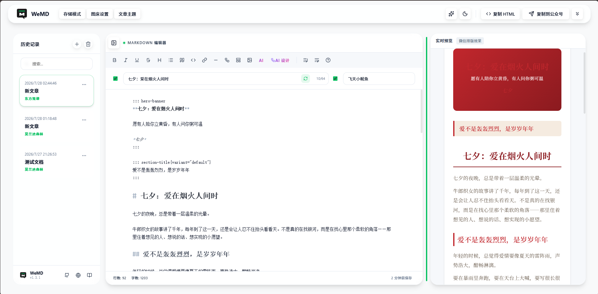
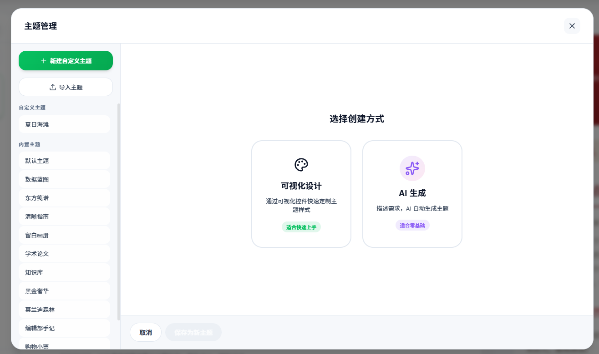

<p align="center">
  
</p>

<h1 align="center">GZH-WeMD</h1>

<p align="center">
  <strong>AI 驱动的公众号 Markdown 排版工具</strong>
</p>

<p align="center">
  杂志级排版 · 44 组件系统 · AI 自动排版 · 多主题切换 · 一键发布到公众号
</p>

---

## 项目来源

本项目基于 [WeMD](https://github.com/tenngoxars/WeMD) 二次开发，感谢原作者 [@tenngoxars](https://github.com/tenngoxars) 的开源贡献。

WeMD 提供了优秀的微信公众号 Markdown 排版基础框架 —— 所见即所得的编辑体验、主题系统、丰富的排版组件、以及一键复制到公众号的核心能力。GZH-WeMD 在此基础上进行了大量扩展，核心新增如下：

### GZH-WeMD 新增能力

| 新增模块                   | 说明                                                                                                                                          |
| -------------------------- | --------------------------------------------------------------------------------------------------------------------------------------------- |
| **AI 排版引擎**            | 纯文本自动结构化 + 内容信号分析 + 自动组件选择 + Designer Review 自检，AI 像专业排版设计师一样决定组件类型、位置和数量                        |
| **Design Intent 系统**     | 组件不再只是"插入"，而是携带设计意图（强调/过渡/总结/数据…），根据用户设计目标（阅读优先/平衡设计/视觉优先）和读者画像动态适配                |
| **Variant 变体系统**       | 同一组件支持 3~4 套造型变体，主题可指定默认变体，AI 排版可按需覆盖，实现同一组件在不同场景下的多样化表现                                      |
| **AI 主题生成**            | 描述风格关键词即可自动生成完整主题（配色、字体、间距、组件样式），支持导入/导出主题包                                                         |
| **Design Goal + 读者画像** | 用户选择设计目标（阅读优先/平衡设计/视觉优先/信息密度）和读者画像（大众阅读/快速浏览/深度阅读/学习研究/决策参考/品牌传播），AI 据此调整策略   |
| **扩展组件**               | 新增产品卡片、品牌签名、资料清单、名人推荐、系列导航等组件，覆盖电商、教育、品牌传播等场景                                                    |
| **Theme SDK 平台**         | 标准化主题包格式（manifest.json + CSS + 资源文件），支持外部 AI 工具生成可直接导入的主题包；内置 wemd-theme-designer skill 自动生成完整主题包 |
| **全组件范文一键加载**     | 工具栏新增"加载全组件范文"按钮，一键填充 44 个组件示范内容，方便主题渲染测试和效果预览                                                        |

---

## 预览

<p align="center">
  
</p>

<p align="center">
  
</p>

---

## AI 排版引擎

核心亮点 —— 不只是"AI 帮你写"，而是"AI 帮你设计"。

### 架构

```
用户输入纯文本 / Markdown
         │
         ▼
   AI 分析内容信号（数据/情绪/结论/过渡）
         │
         ▼
   AI 选择组件 + 设计意图（Design Intent）
         │
         ▼
   Theme 设计语言 × 用户设计目标 → 渲染排版
         │
         ▼
   一键复制到公众号
```

### AI 能力

| 能力            | 说明                                       |
| --------------- | ------------------------------------------ |
| 文本转 Markdown | 纯文本自动结构化，识别标题、列表、引用     |
| AI 杂志排版     | 全文分析 → 自动选组件 → 生成杂志级排版     |
| AI 主题生成     | 描述风格关键词，自动生成完整主题配色和样式 |

### 设计原则

- **Theme 优先级最高**：主题的设计语言主导风格走向，用户偏好为软建议
- **组件按需存在**：每个组件必须解决具体问题，删除测试判定去留
- **Designer Review 自检**：AI 生成后自审查，剔除无意义组件

---

## 组件系统

44 个排版组件，覆盖公众号常见排版需求：

- **signature 组（4）**：hero-banner、brand-sign、magazine-cover、end-card
- **heading 组（4）**：numbered-heading、section-title、toc-nav、article-section
- **container 组（10）**：text-card、image-card、image-grid、image-text-row、image-caption、image-compare、two-column-cards、quote-card、testimonial-card、author-card
- **data 组（9）**：stats-block、timeline、styled-table、table、resource-list、series-nav、product-card、faq、accordion
- **interactive 组（6）**：callout、callout-pro、cta-card、share-card、follow-bar、qr-card
- **code 组（2）**：code-frame、code-block
- **divider 组（9）**：divider-fancy、divider、section-divider、full-quote、pullquote、tag-label、copyright-notice、related-posts、steps

每个组件支持多套变体（variant），主题可指定默认造型，AI 排版可按需覆盖。

---

## 主题系统

内置 14 套主题：商务 / 学术 / 科技 / 自然 / 极简 / 创意 等风格全覆盖，支持 AI 自动生成自定义主题。

- 设计令牌（Design Token）：颜色、字体、间距统一管理
- 变体系统：同一组件多套造型，`data-variant` 切换
- 深色模式：所有主题自动适配
- 响应式：移动端自适应

---

## 公众号发布

两种方式，同一份产物：

- **复制到公众号**：富文本格式，直接粘贴到公众号编辑器
- **复制 HTML**：配合浏览器插件，完整保留样式

内置元信息管理（标题、作者），支持快捷同步和历史联想。

---

## 快速开始

```bash
# 安装依赖
pnpm install

# 启动开发服务器
pnpm dev:web
# 或双击 start-web.bat

# 启动桌面端（Electron）
pnpm dev:desktop
```

### 构建

```bash
# Web
pnpm --filter @wemd/web build

# Windows
pnpm --filter wemd-electron build:win

# macOS
pnpm --filter wemd-electron build:mac

# Linux
pnpm --filter wemd-electron build:linux
```

---

## 项目结构

```text
├── apps/
│   ├── web/              # React + Vite 前端
│   │   └── src/
│   │       ├── components/  # UI 组件
│   │       ├── services/    # AI、图片、微信复制等服务
│   │       ├── store/       # Zustand 状态管理
│   │       └── hooks/
│   └── electron/         # Electron 桌面端
├── packages/
│   └── core/            # 核心库（Markdown 解析、主题、组件）
│       └── src/
│           ├── components/    # 组件注册表、变体
│           ├── plugins/       # markdown-it 插件
│           └── theme-renderer/# 主题渲染管线
├── skills/
│   └── wemd-theme-designer/ # AI 主题生成 skill
├── wechat-plugin/        # 浏览器插件
├── docs/                 # 开发文档
└── scripts/              # 构建脚本
```

---

## License

详见 [LICENSE](LICENSE)。
