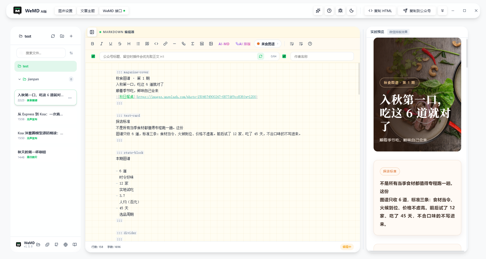
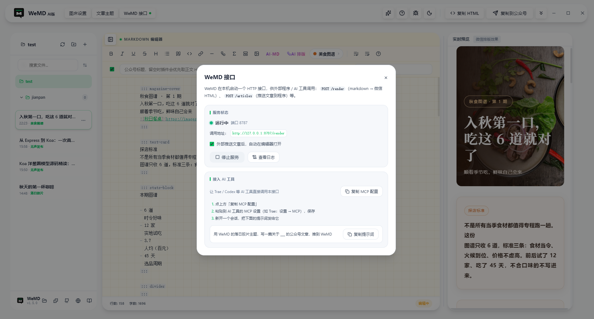

<p align="center">
  
</p>

<h1 align="center">GZH-WeMD</h1>

<p align="center">
  <strong>AI 驱动的公众号 Markdown 排版工具</strong>
</p>

<p align="center">
  杂志级排版 · 44 个组件 · 18 套主题 · AI 排版 · 接口 / MCP
</p>

<p align="center">
  <a href="https://github.com/ldlkuz/gzh-wemd/actions/workflows/ci.yml"></a>
  <a href="https://github.com/ldlkuz/gzh-wemd/releases"></a>
  <a href="LICENSE"></a>
</p>

---

## 目录

- [这是什么](#这是什么)
- [三种使用方式](#三种使用方式)
- [功能](#功能)
- [预览](#预览)
- [快速开始](#快速开始)
- [接入 AI 工作流](#接入-ai-工作流)
- [AI 排版](#ai-排版)
- [组件系统](#组件系统)
- [主题系统](#主题系统)
- [公众号发布](#公众号发布)
- [常见问题](#常见问题)
- [项目结构](#项目结构)
- [相关文档](#相关文档)
- [项目来源](#项目来源)

---

## 这是什么

写 Markdown，得到可直接粘贴进公众号的排版。

GZH-WeMD 把「内容」和「排版」拆开：你用通用 Markdown 写正文，程序按主题把组件（卡片、数据块、时间线、封面、结尾卡…）渲染成微信兼容的 HTML，一键复制到公众号后台；也可以让 AI 按当前主题的组件手册自动重排。

同时它对外提供一个本机接口（以及配套的 MCP 服务），让 AI 工具、脚本、Skill 能直接调用排版能力，或把成稿推送进程序。

## 三种使用方式

| 方式               | 适合                 | 入口                                                                                             |
| ------------------ | -------------------- | ------------------------------------------------------------------------------------------------ |
| **桌面版**（推荐） | 个人创作             | 从 [Releases](https://github.com/ldlkuz/gzh-wemd/releases) 下载安装包（Windows / macOS / Linux） |
| **Web 版**         | 自部署、团队内共享   | Docker 部署到自己的服务器（见下方快速开始）                                                      |
| **接口 / MCP**     | 接入自己的 AI 工作流 | 程序内启动「WeMD 接口」，复制 MCP 配置发给 AI 工具                                               |

## 功能

| 模块                 | 说明                                                                                                |
| -------------------- | --------------------------------------------------------------------------------------------------- |
| **AI 设计版式**      | AI 分析全文，识别文章类型，逐处给出组件插入建议（位置 / 组件 / 理由），可预览、采纳、跳过或批量应用 |
| **AI 杂志排版**      | 一键生成完整版式模板（Template JSON），应用后全文自动排版                                           |
| **44 个排版组件**    | 覆盖卡片、数据、导航、引用、代码、图文、列表等常见公众号排版场景                                    |
| **主题系统**         | 18 套内置主题 + 可视化主题设计器 + 导入/导出主题包（`.wemd-theme`）；支持深色模式                   |
| **一键发布到公众号** | 富文本复制直接粘贴，或复制 HTML 配合浏览器插件                                                      |
| **多图床**           | 官方图床开箱即用 / 阿里 OSS / 腾讯 COS / 七牛 / S3，粘贴图片自动处理并上传                          |
| **本地工作区**       | 以本地文件夹为工作区，文章即文件；支持历史记录、目录监听与文件管理                                  |
| **对外接口**         | 本机 HTTP 接口 + MCP 服务，让外部 AI / 脚本调用排版与推送能力                                       |

## 预览

<p align="center">
  
</p>

<p align="center"><sub>主界面 —— 左侧 Markdown 编辑，右侧实时预览，顶部切主题与发布</sub></p>

<p align="center">
  
</p>

<p align="center"><sub>杂志级排版效果 —— 封面、数据块、时间线等组件由主题骨架渲染</sub></p>

---

## 快速开始

### 环境要求（源码运行 / 二次开发）

- **Node.js ≥ 18**（CI 与本地开发推荐 22，仓库含 [.nvmrc](.nvmrc)）
- **pnpm 9**（`corepack enable` 后自动按 `packageManager` 字段取用）

### 桌面版（普通用户）

从 [Releases](https://github.com/ldlkuz/gzh-wemd/releases) 下载对应平台的安装包：

- **Windows**：`WeMD-Setup-<版本>.exe`
- **macOS**（Apple Silicon）：`WeMD-<版本>-arm64-mac.zip`
- **Linux**：`WeMD-<版本>.AppImage`

首次启动会自动在「文档 / WeMD」下创建工作区，并放入一篇 `示例文章.md`，直接打开它就能看到全部组件的排版效果。

### Web 版（自部署）

```bash
# 直接用 compose 起服务（默认 http://localhost:8080）
docker compose up -d

# 或自行构建镜像
docker build -t wemd-web .
docker run -p 8080:80 wemd-web
```

Web 版没有 Node 进程，因此不提供「WeMD 接口」，其余排版能力一致。首次打开需要选择一个文件夹作为工作区。

### 开发者（源码运行）

```bash
pnpm install

pnpm dev:desktop   # 桌面端（自动先起 Web 开发服务器）
pnpm dev:web       # 仅 Web 版，http://localhost:5173

pnpm test          # 全量测试
pnpm typecheck     # 暂无聚合命令，按包运行：
                   #   pnpm --filter @wemd/server run typecheck
                   #   pnpm --filter @wemd/mcp run typecheck
pnpm build         # 全量构建
```

平台安装包打包（macOS / Windows / Linux）见 [apps/electron/README.md](apps/electron/README.md)。

---

## 接入 AI 工作流

程序内置一个本机 HTTP 接口（默认 `127.0.0.1:8787`，仅监听本机、无鉴权），把排版能力开放给外部程序。**桌面版默认随程序自动启动**。

**MCP 接入（推荐）**——让 Trae / Codex / Cursor 等 AI 工具直接调用：

1. 点顶部「WeMD 接口」打开面板，点「启动服务」
2. 点「复制 MCP 配置」，粘贴到 AI 工具的 MCP 设置并保存
3. 新开一个会话，把面板里给的示例提示词发给它

配置指向 WeMD 程序自身（配合 `ELECTRON_RUN_AS_NODE`），**本机无需另外安装 Node**。接入后 AI 可用的工具：`list_themes`、`get_theme_guide`、`render_markdown`、`push_article`。

**HTTP 直接调用**（脚本 / Skill）：

| 端点                    | 作用                                      |
| ----------------------- | ----------------------------------------- |
| `GET /health`           | 健康检查（版本 / 工作区就绪状态）         |
| `GET /themes`           | 列出主题                                  |
| `GET /themes/:id/guide` | 取该主题的组件语法手册（AI 写作前应先取） |
| `POST /render`          | markdown → 微信安全 HTML                  |
| `POST /articles`        | 把文章写入工作区，程序自动打开并套用主题  |

仓库内提供命令行推送脚本：

```bash
node scripts/wemd-push.mjs article.md --theme sunset-film --title "标题"
```

完整接口说明见 [docs/engineering/render-api-article-push.md](docs/engineering/render-api-article-push.md)。

---

## AI 排版

不只是「AI 帮你写」，而是「AI 帮你设计」。

```
用户输入纯文本 / Markdown
         │
         ▼
   AI 分析内容信号（数据 / 情绪 / 结论 / 过渡）
         │
         ▼
   AI 给出组件插入建议 / 生成完整版式模板
         │
         ▼
   主题设计语言 × 排版方案 → 渲染
         │
         ▼
   一键复制到公众号
```

**设计原则**：主题优先级最高（用户偏好为软建议）；组件按需存在（每个组件解决具体问题）；AI 输出可校验（结构化校验后再渲染）。

---

## 组件系统

共 44 个组件。其中 36 个可在组件面板一键插入，按用途分为 5 组：

| 分组           | 说明                                                    | 代表组件                               |
| -------------- | ------------------------------------------------------- | -------------------------------------- |
| **常用**       | 高频内容块：引用、提示、分割线、代码、表格、标签        | 金句卡片、强化提示、装饰分割线、表格   |
| **图文卡片**   | 视觉主体：封面、图卡、图文混排、正文卡、双栏 / 整行引用 | 杂志封面、图片卡片、图片网格、图文混排 |
| **数据与列表** | 结构化信息：数据块、步骤、时间线、清单、FAQ、手风琴     | 数据统计、时间线、常见问题、折叠手风琴 |
| **头尾引导**   | 转化与收尾：头图、关注引导、二维码、分享、结尾卡、版权  | 顶部头图、关注引导、结尾致谢、作者卡片 |
| **品牌推荐**   | 商业化：产品卡、品牌签名、名人推荐、系列导航            | 产品卡片、品牌签名、名人推荐、系列导航 |

其余 8 个（引语、分割线、数据表格、图注、章节标题、编号标题、代码块、正文段落）由原生 Markdown 自动识别，无需专用语法。

组件采用「骨架模板 + 槽位填充」渲染，主题可通过模板骨架定制组件结构（骨架 / 皮肤分离），保证预览与导出一致。

---

## 主题系统

内置 **18 套主题**，覆盖商务 / 学术 / 科技 / 自然 / 极简 / 创意 / 内容等多个风格：

默认主题、数据蓝图、东方笺谱、清晰指南、留白画册、学术论文、知识库、黑金奢华、
莫兰迪森林、编辑部手记、购物小票、落日胶片、无声发布、故事集、好物种草、美食图谱、
民宿纪、晚晴

- **可视化设计器**：分项调整配色 / 字体 / 间距 / 标题 / 组件样式，实时预览
- **导入主题包**：导入 `.wemd-theme` 主题包，支持同名主题覆盖
- **设计令牌**：颜色、字体、间距统一管理；骨架 / 皮肤分离
- **微信兼容**：发布链路无伪元素残留、无定位残留，预览与导出一致

---

## 公众号发布

- **复制到公众号**：生成富文本，直接粘贴到公众号编辑器，所见即所得
- **复制 HTML**：得到微信安全的内联样式 HTML，配合 [wechat-plugin](wechat-plugin/) 浏览器插件插入公众号后台

内置标题 / 作者元信息管理，支持历史联想。

---

## 常见问题

**组件写了却没生效？**
多半是漏了配对的收尾 `:::`。这类块会被当作普通文字渲染，编辑器中该起始行会显示琥珀色波浪线并给出提示，补上收尾即可。

**粘到公众号后样式和预览不一样？**
用「复制到公众号」（富文本）或「复制 HTML」+ 浏览器插件两条链路，预览与导出已对齐。注意不要手动改粘贴后的 HTML。

**AI 排版用不了？**
需要先在顶部「AI 设置」里填 OpenAI 兼容的 Base URL 与密钥。不配置不影响手写排版与复制，只是用不了 AI 改写。

**图片上传失败 / 粘到公众号是裂图？**
默认使用官方图床，无需配置。若要存到自己的云，在顶部「图床设置」里选七牛 / 阿里 OSS / 腾讯 COS / S3 并填好参数。

**浏览器版为什么没有「WeMD 接口」？**
该接口依赖本机 Node 进程，只有桌面版能提供。

**`docker compose up` 拉的是哪个镜像？**
`ghcr.io/ldlkuz/gzh-wemd-web:latest`，可用环境变量 `WEMD_IMAGE` 覆盖。

**macOS 有 Intel 版本吗？**
目前只发布 Apple Silicon（arm64）构建。

---

## 项目结构

```text
├── apps/
│   ├── web/          # React + Vite 前端（主程序 UI、渲染管线、AI 排版）
│   ├── electron/     # 桌面端外壳（窗口、文件系统、工作区监听、更新检查）
│   ├── server/       # 本机 HTTP 接口服务（/render、/articles 等）
│   └── mcp/          # MCP 瘦代理：把本机接口包装成 AI 工具
├── packages/
│   └── core/         # 核心库（Markdown 解析、组件、主题、模板、CSS 内联）
├── wechat-plugin/    # 公众号 HTML 插入浏览器插件（随桌面版分发）
├── scripts/          # 构建、版本同步与推送脚本
├── docs/             # 开发文档
├── Dockerfile / docker-compose.yml / nginx.conf   # Web 版自部署
└── .nvmrc            # 开发 Node 版本
```

## 相关文档

- 应用内：「使用帮助」弹窗（从写稿到发布的分步引导）
- 接口与文章推送：[docs/engineering/render-api-article-push.md](docs/engineering/render-api-article-push.md)
- 主题开发：[docs/engineering/theme-development-guide.md](docs/engineering/theme-development-guide.md)
- 更新日志：[CHANGELOG.md](CHANGELOG.md)

---

## 项目来源

本项目基于 [WeMD](https://github.com/tenngoxars/WeMD) 二次开发，感谢原作者 [@tenngoxars](https://github.com/tenngoxars) 的开源贡献。

WeMD 提供了公众号 Markdown 排版的基础框架 —— 所见即所得的编辑体验、主题系统、排版组件以及一键复制到公众号的核心能力。GZH-WeMD 在此基础上进行了大量扩展。

## License

详见 [LICENSE](LICENSE)。
